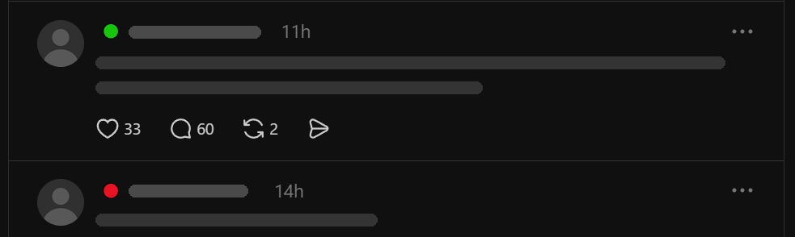
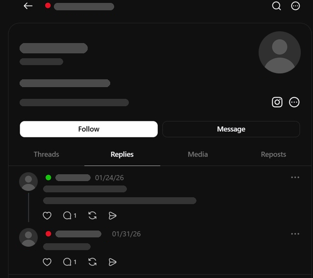
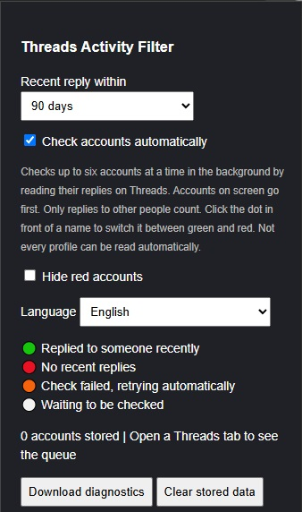

# threadcheck 🟢🔴

### See at a glance who is real on Threads, and who is just a ghost.

Threads is flooded with **ghost accounts**: profiles that automatically copy their Instagram posts and never reply to anyone, accounts that follow you but never say a word, and profiles you just can't figure out.

Finding out who is actually real takes forever. Open a profile. Tap *Replies*. Scroll. Check the dates. Go back. Next profile. Again and again. It eats your time, and it's **really annoying**.

**threadcheck does all of that for you, automatically.** It puts a small coloured dot in front of every name on Threads:

| | |
|---|---|
| 🟢 **Real and active** | This person actually talks to people. They replied to someone recently. |
| 🔴 **Ghost** | No replies at all, or not for months. Usually an account that only copies its Instagram posts. |
| ⚪ **Checking…** | Give it a second. |
| 🟠 **Couldn't check** | Don't worry, it tries again by itself. |

No more guessing. No more clicking through profiles. Just scroll through Threads like you always do, and you instantly see who is worth your time.

### Why you'll love it

- ⏱️ **Saves you loads of time:** no more opening profile after profile to check if someone is real.
- 😌 **Way less irritation:** spot ghost accounts *before* you reply, follow or get pulled into a conversation.
- 👀 **Works while you scroll:** the dots appear by themselves, in your feed, on profiles and in replies.
- 🙈 **Hide the ghosts:** one switch and red accounts disappear from your feed.
- ✋ **You're the boss:** tap a dot to make someone green or red yourself.
- 🔒 **Private and free:** no account, no sign-up, nothing sent anywhere. Everything stays on your own device.
- 📱 **Phone and computer:** Android phones (with Firefox), and Firefox or Chrome on your computer.
- 🔄 **Always up to date:** in Firefox, new versions install themselves.

### 👉 [Install it in 5 minutes](#before-you-start)

Easy step-by-step guide. No technical knowledge needed.

## What it looks like

*Names, profile pictures and posts are hidden in these examples for privacy.*

**In your feed:** a dot in front of every name.

**On a profile and in replies:** the same dots appear everywhere a name is shown.

**The menu:** choose how far back to look, hide red accounts and pick your language.

---

## Before you start

- It only works in a **web browser** on the Threads website (threads.com). It does **not** work inside the Threads app.
- On a phone you need the free **Firefox** browser. Chrome and Samsung Internet on a phone cannot do this.
- It is free. You do not need an account. It takes about 5 minutes.

**Which device do you have?**

- Android phone (Samsung, Pixel, Xiaomi, …) → [Part A](#part-a-android-phone)
- Computer with Firefox → [Part B](#part-b-computer-with-firefox)
- Computer with Chrome → [Part C](#part-c-computer-with-chrome)
- iPhone or iPad → sorry, this is not possible. Apple does not allow it.

---

## Part A: Android phone

### Step 1 – Install Firefox

1. Open the **Play Store** app.
2. Search for **Firefox**.
3. Tap **Install**.

Already have Firefox (the orange fox icon)? Skip this step.

### Step 2 – Log in to Threads in Firefox

1. Open **Firefox**.
2. Tap the address bar at the top, type **threads.com** and tap Enter.
3. Log in, the same way you log in to the Threads app.

### Step 3 – Download the add-on

1. In Firefox, go to **github.com/blyoco/threadcheck/releases/latest**
2. Scroll down to the heading **Assets**.
3. **Press and hold** your finger on **threadcheck-firefox.xpi**.
4. A menu appears. Tap **Download link**.

The file is now in your **Downloads**.

### Step 4 – Switch on the hidden install option

Firefox hides this option, so you have to switch it on once.

1. Tap the **three dots ⋮** (bottom right or top right).
2. Tap **Settings**.
3. Scroll all the way down and tap **About Firefox**.
4. Tap the big **Firefox logo 5 times quickly**.
5. A short message appears saying the debug menu is enabled.

### Step 5 – Install the add-on

1. Tap the **back arrow ←** to return to **Settings**.
2. Look for **Install extension from file** and tap it.
3. Your files open. Go to **Downloads** and tap **threadcheck-firefox.xpi**.
4. Firefox asks if you want to add **Threads Activity Filter**. Tap **Add**.
5. Tap **Okay** on the next message.

### Step 6 – Use it

1. Go to **threads.com** in Firefox.
2. Wait a few seconds. A dot appears in front of each name.

**Done!** Updates arrive automatically. You never have to do this again.

**No dots?**

1. Tap the **three dots ⋮** → **Extensions** (or **Add-ons**).
2. Tap **Threads Activity Filter** → **Permissions**.
3. Switch on access to **threads.com**.
4. Go back to threads.com and pull the page down to refresh it.

**Tip:** on threads.com, tap **⋮** → **Add to Home screen**. You get a Threads icon on your phone that opens Threads with the dots.

---

## Part B: Computer with Firefox

### Step 1 – Log in to Threads

1. Open **Firefox**.
2. Go to **threads.com** and log in.

### Step 2 – Install the add-on

1. In Firefox, go to **github.com/blyoco/threadcheck/releases/latest**
2. Scroll down to the heading **Assets**.
3. Click **threadcheck-firefox.xpi**.
4. A message may appear at the top: *Firefox prevented this site from asking you to install software*. Click **Continue to Installation**.
5. Firefox asks if you want to add **Threads Activity Filter**. Click **Add**.
6. Click **Okay**.

**The file was only downloaded and nothing else happened?** Then do this:

1. Type **about:addons** in the address bar and press Enter.
2. Click the **gear icon ⚙**.
3. Click **Install Add-on From File…**
4. Open your **Downloads** folder and choose **threadcheck-firefox.xpi**.
5. Click **Add**.

### Step 3 – Use it

Go to **threads.com**. After a few seconds there is a dot in front of each name.

**Done!** Updates arrive automatically.

---

## Part C: Computer with Chrome

### Step 1 – Download the add-on

1. Go to **github.com/blyoco/threadcheck/releases/latest**
2. Scroll down to the heading **Assets**.
3. Click **threadcheck-chrome.zip**. The file is downloaded.

### Step 2 – Unzip the file

1. Open your **Downloads** folder.
2. **Windows:** right-click **threadcheck-chrome.zip** → **Extract All…** → **Extract**.
   **Mac:** double-click **threadcheck-chrome.zip**.
3. You now have a folder called **threads-activity-filter**.
4. Move this folder to a place where you will not delete it, for example **Documents**. Chrome needs this folder to stay there.

### Step 3 – Add it to Chrome

1. In Chrome, type **chrome://extensions** in the address bar and press Enter.
2. Top right: switch on **Developer mode**.
3. Top left: click **Load unpacked**.
4. Choose the **threads-activity-filter** folder and click **Select Folder**.
5. **Threads Activity Filter** now appears in the list.

### Step 4 – Use it

Go to **threads.com**. If Threads was already open, press **F5** to refresh. After a few seconds there is a dot in front of each name.

**Done!**

**Getting a new version:** Chrome does not update this add-on by itself. Download the new zip, unzip it, replace the old folder with the new one, then go to **chrome://extensions** and click the round arrow **↻** on Threads Activity Filter.

---

## Using it

- **Change a colour yourself:** tap or click the dot. Green becomes red, red becomes green.
- **Settings:** open the add-on menu. In Chrome, click the puzzle piece icon at the top right. On Android, tap **⋮** → **Extensions**. There you can choose how far back to look (30 days, 90 days, 1 year or your own number of months) and choose to hide red accounts.
- **Language:** the add-on uses the language of your browser automatically (English or Dutch). To change it, open the add-on menu and choose **English** or **Nederlands** under **Language**.

## Questions

**Is it safe?**
Yes. The add-on only looks at threads.com. It does not send your data anywhere. Everything is stored on your own device.

**Why is a dot white for a while?**
That account is being checked. It usually takes less than a second per account.

**Why is a dot orange?**
Threads did not answer in time. The add-on tries again by itself after 15 minutes.

---

## For the developer: releasing a new version

1. Increase `version` in [manifest.json](threads-activity-filter/manifest.json).
2. Commit and push to `main`.

The [Release](.github/workflows/release.yml) workflow builds both versions, has the Firefox version signed by Mozilla (unlisted), creates a GitHub release with both files and adds the version to [updates.json](updates.json). Firefox users get the update automatically, usually within a day.

**One-time setup:**

1. Create API credentials at [addons.mozilla.org/developers/addon/api/key](https://addons.mozilla.org/developers/addon/api/key/).
2. In this repository, go to **Settings → Secrets and variables → Actions** and add two repository secrets: `AMO_JWT_ISSUER` (the JWT issuer) and `AMO_JWT_SECRET` (the JWT secret).
3. Run the workflow once via **Actions → Release → Run workflow**.

Automatic updates only work while this repository is public, because Firefox has to download `updates.json` and the release files without logging in.

To build locally, run `python bouw.py`; the zip files end up in `dist/`.

**How the check works:** for each account the add-on fetches `/@name/replies` from the open Threads tab and reads the reply dates from the data Threads already includes in that page. No extra tabs, no frames, no server, no API key. Requests are made without cookies first; only if that returns nothing, the add-on retries once with the user's own Threads session.

## Changelog

- **0.2.4** – "Hide red accounts" now hides the whole post, not just the name. Nothing is hidden on the profile or post page of the account you opened yourself.
- **0.2.3** – Menu and tooltips in English and Dutch. Follows the browser language, or choose it yourself in the menu.
- **0.2.2** – Firefox updates itself automatically via GitHub releases.
- **0.2.1** – Firefox support, on computer and Android.
- **0.2.0** – New check method: reads replies from the page data instead of hidden frames, which Threads blocks. About 0.5–1 second per account, six at a time.

Older notes (in Dutch) are in [LEESMIJ.txt](LEESMIJ.txt).
